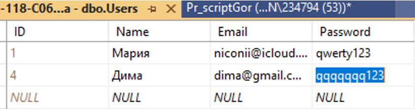
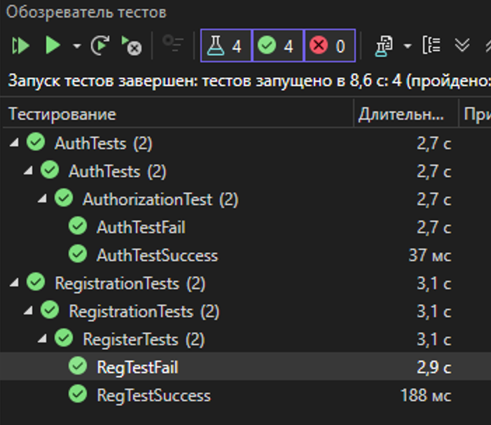

## Практическая работа №6.3
Дисциплина:
Поддержка и развитие программных модулей
### Название практической работы: Создание автоматизированных unit-тестов
## Разработчики
Студенты Николаева Мария и Погосян Эдик группы 3ИСИП-223

# № Вывод о проведенном тестировании

## Тестирование регистрации

**Позитивный тест:** Успешно выполнен. При вводе корректных данных пользователь успешно регистрируется и добавляется в базу данных.

**Негативные тесты:** Успешно выполнены. Система корректно отклоняет некорректные данные: пустые поля, короткий пароль, пароль без цифр, несовпадающие пароли, неправильный формат email, а также не позволяет зарегистрироваться с уже существующим email.

## Тестирование авторизации

**Позитивный тест:** Успешно выполнен. При вводе правильных email и пароля пользователь успешно входит в систему.

**Негативные тесты:** Успешно выполнены. Система корректно отклоняет неверный пароль, пустые поля, неправильный формат email, короткий пароль и несуществующего пользователя.

## Общий итог

Все тесты пройдены успешно. Функционал регистрации и авторизации работает корректно, валидация данных выполняется правильно. Система готова к использованию.
